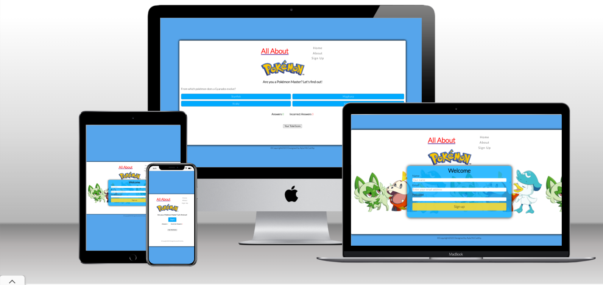
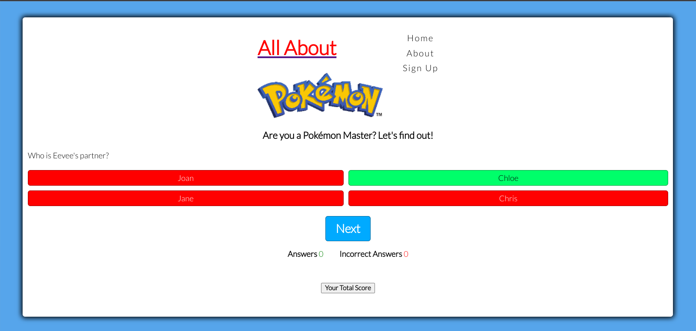
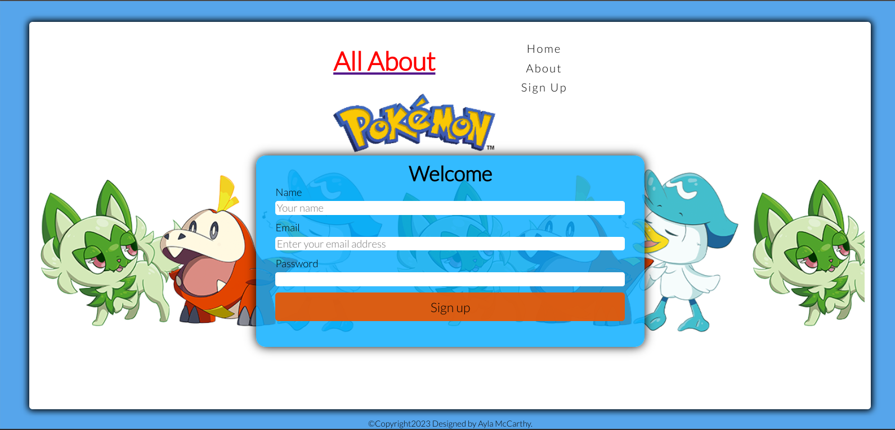
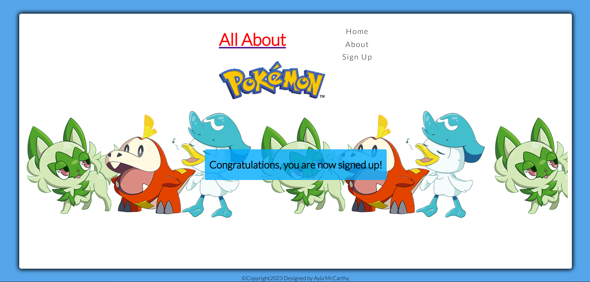
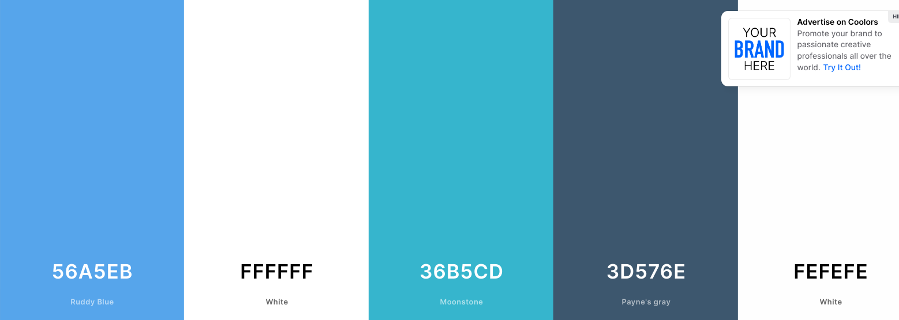
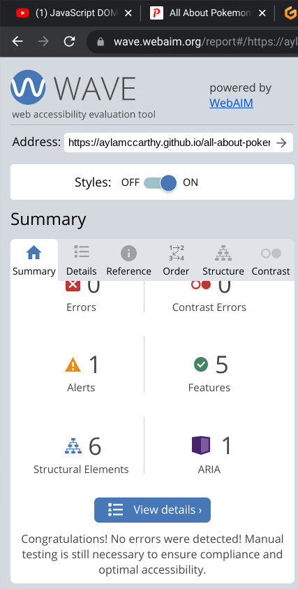
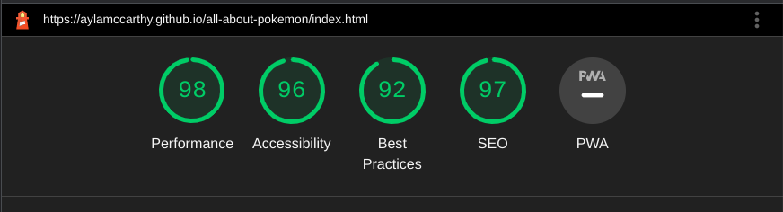
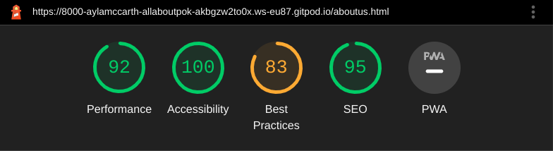
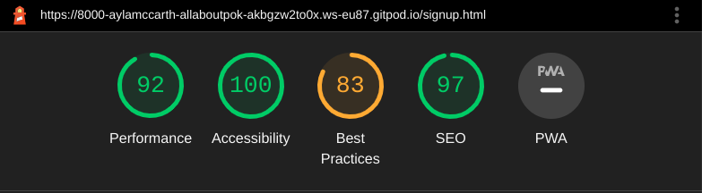

# **All About Pokémon**

All About Pokémon is a fun Pokémon-themed website that features fun  activities for kids and grown-ups alike. For now, the website only feature a simple quiz game. But the goal is, for future release, the website will have more activities, such as memory game, puzzles, spellings, word search and more. All pokémon-themed of course. I got this idea from my three young kids who all love and enjoy anything and everything about Pokémon.

View the live website here [All About Pokemon!](https://aylamccarthy.github.io/all-about-pokemon/).




## User Experience

### Initial Discussion
Quizzes have always been a popular choice of entertainment for kids and grown ups. This project was inspired by my three young children who are always up for a challenge, and love everything about Pokémon. And what better way to build a project than to combine these two and make an amazing Pokémon-themed website that will surely entertain both children and grown ups.


### External User's Goal:

* To be able to visit the website and play the game.
* To have fun while engaging ones brain.
* To be able to play the game on different devices.


### Site Owner's Goal:

* To be able to offer a fully responsive and interactive website that will entertain the user. 
* To be able to satisfy user's expectation so they will come back to the website as returning visitors.

### Possible Future Plans:
* To be able to upload new materials weekly, every Monday. To make sure to engage users and guarantee repeat visits.
* To offer more variety than just quizzes. For example, I would like to upload other games as well, such as puzzles, word search, spellings and memory games.
* To include a feature where users can save their progress.


## TABLE OF CONTENTS

* [Features](#Features)
    * [Site Wide](#site-wide)
    * [Landing Page](#landing-page)
    * [Sign Up PAge](#sign-up-page)
    * [Existing Features](#existing-features)
    * [Features Left to Implement](#possible-future-plans)


* [Design](#design)

    * [Wireframes](#wireframes)

* [Technologies](#technologies)
    * [HTML](#html)
    * [CSS](#css)
    * [Github](#github)
    * [Git](#git)
    * [Tinyjpg](#tinypng)
    * [balsamiq](#balsamiq)

* [Testing](#testing)
    * [Responsiveness](#responsiveness)
    * [Accessibility](#accessibility)
        * [Wave](#wave-accessibility)
        * [Lighthouse](#lighthouse-testing)
    * [Functional Testing](#functional-testing)
    * [Validator Testing](#validator-testing)
        * [HTML](#html)
        * [CSS](#css)

* [Bugs/Unfixed Bugs](#bugsunfixed-bugs)

* [Deployment](#deployment)
    * [Version Control](#version-control)
    * [Deployment to Github Pages](#deployment-to-github-pages)
    * [Clone the Repository Code Locally](#clone-the-repository-code-locally)

* [Credits](#credits)

* [Content](#content)

    


## Features
 The website has three pages.
 * Home page- the landing page where the quiz game is located.
 * About Page- where website users will find all the website information.
 * Sign Up page - where website users will be provided an option to sign up through a form.

### Site Wide
* Navigation Menu
* Contains links to the Home, About Us and sign Up pages and will be responsive on all devices.
This will allow users to easily navigate between the pages within the site on any device size.


### Landing Page

* The page has an appealing design and an intuitive navigation and orientation.
* The website is fully responsive on all screen sizes.
* Easy access to start the game.
* All these features aim to help to immediately show and entice the user what the website is about and how much fun they will have should they decide to proceed and play the game.


### Sign Up Page
 * A sign up form is provided to allow users to sign up to the website. The form will consist of the following fields and attributes:
    * Name (required, type=text)
    * Email (required, type=email)
    * Password (required, type=password)
    


* On successful submission of the Sign up form, the user will be navigated to thankyou.html displaying a success message.





### Existing Features

* Responsive design
* Interactive quiz game
* Sign up form and success page

### Color Scheme

The website uses a pallete of pastel colors generated from https://coolors.co/generate. This is intentional choice to complement the bright and colorful world of Pokémon.



### Typography

Google Fonts was used for the following fonts:
* Lato
* Chivo Mono

### Accessibility

I have been mindful throughout the building process to ensure that the website is as accessible as possible. I tried to achieve this by:

 * Using semantic HTML.
 * Using  descriptive  alt attribute on images on the site.
 * Providing information for screen readers where there are icons and no text used, such as the footer icons.
 * Guaranteeing adequate colour contrast  throughout the site.


### 404 Page
The website has a custom 404 page with adequate information to guide users back to the site, should they happen to type the wrong URL or used broken links.


## Design

### Wireframes
<br><br>
Home page
<br><br>


Contact form successful submission page.


Gallery page


Sign Up Form


## Technologies

* HTML
    * The structure of the Website was developed using HTML as the main language.
* CSS
    * The Website was styled using custom CSS in an external file.
* JavaScript
    * JavaScript was used to ensure interactivity.
* GitHub
    * Source code is hosted on GitHub and delpoyed using Git Pages.
* Git
    * Used to commit and push code during the development of the Website
* Font Awesome
    * Icons obtained from https://fontawesome.com/ were used as the Social media links in the footer section.
* Tinyjpg
    * https://tinyjpg.com/ was used to reduce the size of the images used throughout the website
* balsamiq
    * Wireframes were created using balsamiq from https://balsamiq.com/wireframes/desktop/#
* Coolors.co
    * The colour pallete used throughout the site was generated from Coolors.


## Testing

Testing was ongoing throughout the entire build. I utilised Chrome Developer tools while building to pinpoint and troubleshoot any issues as I went along.

### Responsiveness

All pages were tested to ensure responsiveness on screen sizes from 320px and upwards as defined in WCAG 2.1 Reflow criteria for responsive design on Chrome, Edge, Firefox and Opera browsers.

Steps to test:

1. Open browser and navigate to Cobh Children's Theatre
2. Open the developer tools (right click and inspect)
Set to responsive and decrease width to 320px
3. Set the zoom to 50%
4. Click and drag the responsive window to maximum width.


Expected:

Website is responsive on all screen sizes and no images are pixelated or stretched. No horizontal scroll is present. No elements overlap.

Actual:

Website behaved as expected with the exception of switching to the viewport size to 320px. Details can be found in Unfixed Bugs.


### Accessibility

# Wave Accessibility

Wave Testing Issue:

The first testing gave a poor contrast result with the foreground text and background color.

[Wave Accessibility](https://wave.webaim.org/) tool was used throughout development and for final testing of the deployed website to check for any aid accessibility testing.




Testing was focused to ensure the following criteria were met:

- All forms have associated labels or aria-labels so that this is read out on a screen reader to users who tab to form inputs.
- Color contrasts meet a minimum ratio as specified in WCAG 2.1 Contrast Guidelines.
- Heading levels are not missed or skipped to ensure the importance of content is relayed correctly to the end user.
- All content is contained within landmarks to ensure ease of use for assistive technology, allowing the user to navigate by page regions.
- All not textual content had alternative text or titles so descriptions are read out to screen readers
HTML page lang attribute has been set.
- Aria properties have been implemented correctly.
- WCAG 2.1 Coding best practices being followed.

## Lighthouse Testing

### Home Page



### About Us Page


### Sign Up Page


### Functional Testing

**Navigation Links**

Testing was performed to ensure all navigation links on the respective pages, navigated to the correct pages as per design. This was done by clicking on the navigation links on each page.

| Navigation Link | Page to Load  |
|-----------------|---------------|
| Home            |  index.html   |
| Gallery         |  gallery.html |
| Sign Up         |  sign-up.html |

Links on all pages navigated to the correct pages as expected.

**Form Testing**

The form on the sign up page was tested to ensure it functioned as expected when correct data was input and when incorrect data was input. The following test scenarios were covered:

_Scenario One - Correct Inputs_

Steps to test:

1. Navigate to [Cobh children's Theatre](https://aylamccarthy.github.io/cobh-childrens-theatre/) Sign Up Page.

2. Scroll down to the form and input the following data:
    - Child's Full Name: John McCarthy
    - Parent/Guardian's Full Name: Mike McCarthy
    - Parent/Guardian's Contact Number: 123456789
    - Email: mmcarthy@gmail.com
3. Click Submit
4. User should be redirected to contact.html confirmation page

Expected:

Form submits with no warnings or errors and user is redirected to contact.html confirmation page.

Actual:

Website behaved as expected with no errors or warnings and redirected to thankyou.html.

_Scenario Two - Missing Required Field  Child's Full Name_

Steps to test:

1. Navigate to [Cobh children's Theatre](https://aylamccarthy.github.io/cobh-childrens-theatre/) Sign Up Page.
2. Scroll down to the form and input the following data:
    - Child's Full Name: 
    - Parent/Guardian's Full Name: Mike McCarthy
    - Parent/Guardian's Contact Number: 123456789
    - Email: mmcarthy@gmail.com
3. Click Submit

Expected:

The form does not submit and an Error is displayed to tell the user that the field is required.

Actual:

Website behaved as expected, error message was displayed and the form did not submit.

_Scenario Three - Missing Required Field Parent/Guardian's Full Name_

Steps to test:

1. Navigate to [Cobh children's Theatre](https://aylamccarthy.github.io/cobh-childrens-theatre/) Sign Up Page.
2. Scroll down to the form and input the following data:
    - Child's Full Name: John McCarthy
    - Parent/Guardian's Full Name: 
    - Parent/Guardian's Contact Number: 123456789
    - Email: mmcarthy@gmail.com

3. Click Submit

Expected:

The form does not submit and an Error is displayed to tell the user that the field is required.

Actual:

Website behaved as expected, error message was displayed and the form did not submit.

_Scenario Four - Missing Required Field Email_

Steps to test:

1. Navigate to [Cobh children's Theatre](https://aylamccarthy.github.io/cobh-childrens-theatre/) Sign Up Page.
2. Scroll down to the form and input the following data:
    - Child's Full Name: John McCarthy
    - Parent/Guardian's Full Name: 
    - Parent/Guardian's Contact Number: 123456789
    - Email: 
3. Click Submit

Expected:

The form does not submit and an Error is displayed to tell the user that the field is required.

Actual:

Website behaved as expected, error message was displayed and the form did not submit.

_Scenario Five - Incorrect email format_

Steps to test:

1. Navigate to [Cobh children's Theatre](https://aylamccarthy.github.io/cobh-childrens-theatre/) Sign up page.
2. Scroll down to the form and input the following data:
 Child's Full Name: John McCarthy
    - Parent/Guardian's Full Name: 
    - Parent/Guardian's Contact Number: 123456789
    - Email: mmcarthy.gmail.com
3. Click Submit

Expected:

The form does not submit and an Error is displayed to tell the user that a valid email is required and the format it should be in.

Actual:

Website behaved as expected, error message was displayed and the form did not submit.

**Footer Social Media Icons / Links** 

Testing was performed on the Font Awesome Social Media icons in the footer to ensure that each one opened in a new tab.

Each item opened a new tab when clicked as expected.

**Footer Contact Information**

Testing was performed on the phone number in the contact information section of the footer to ensure behaviour was as expected.

_Steps to test Telephone Number_

1. Navigate to [Cobh children's Theatre](https://aylamccarthy.github.io/cobh-childrens-theatre/) Home page.
2. Click the phone number in the footer (01 123 456 789)

Expected:

A window is opened asking which device you would like to call from.

Actual:

Behavior was as expected and the window presented me with the following option to call:

Mobile Phone 0871376895

_Steps to test Email Link_

1. Navigate to [Cobh children's Theatre](https://aylamccarthy.github.io/cobh-childrens-theatre/) Home page.
2. Click the email address in the footer (info.cobhtheatre@gmail.com)

Expected:

A windows pop up is displayed asking what application you would like to send a mail from or your default email application is opened.

Actual:

Behavior was as expected and my outlook application was opened ready to send an email to the target address.

# Validator Testing

## HTML

- No errors were returned when passing through the official W3C validator


## CSS

- No errors were found when passing through the official (Jigsaw) validator
CSS Validator Results


## Bugs/Unfixed Bugs

I encountered so many bugs through out the whole process of building this website. Most of them I resolved on time. But the ones listed below were the ones I found most challenging;

 Responsiveness: 

- Expected: The website would work on all devices, screen sizes and orientation.
- Actual: Responsiveness of the website did not work as expected on mobile devices.
- Solution: With more research and mentor consultation, and changing my codes as necessary, I was able to fix these bugs on time, with the exception of thank you page which is still not working as expected on mobile devices. But will do my very best to have this fixed on future release.

### Before:


### After:


### Unfixed Bug


# Deployment

## Version Control

The site was created using the Visual Studio code editor and pushed to github to the remote repository ‘Cobh-Childrens-Theatre’.

The following git commands were used throughout development to push code to the remote repo:

```git add <file>``` - This command was used to add the file(s) to the staging area before they are committed.

```git commit -m “commit message” ``` - This command was used to commit changes to the local repository queue ready for the final step.

```git push``` - This command was used to push all committed code to the remote repository on github.


## Deployment to Github Pages

- The site was deployed to GitHub pages. The steps to deploy are as follows:
    - In the GitHub repository, navigate to the Settings tab
    - From the menu on left select 'Pages'
    - From the source section drop-down menu, select the Branch: main
    - Click 'Save'
    - A live link will be displayed in a green banner when published successfully.
The live link can be found here -  https://aylamccarthy.github.io/cobh-childrens-theatre/

### Clone the Repository Code Locally

Navigate to the GitHub Repository you want to clone to use locally:

- Click on the code drop down button
- Click on HTTPS
- Copy the repository link to the clipboard
- Open your IDE of choice (git must be installed for the next steps)
- Type git clone copied-git-url into the IDE terminal

- The project will now have been cloned on your local machine for use.

## Credits
* Code Institute "Love Running" project.
* Gareth McGirr  "Tacos Travel" project.
* Kevin Powell Youtube Tutorial- HTML and CSS for Beginners. Responsive Design Made Easy.
* Code Institute-Slack Channel


## Content
All the images are from  and .
Wikipedia and google were used for word definitions.
All contents are owned by Cobh Children's Theatre. 


## Resources, References and Credit

### Media and Fonts

- Google Fonts
- https://pixabay.com/
- https://pexels.com
- Pokemon Annual 2023
- Pokemon Super Deluxe Essential Handbook 
 
### Code

- https://developer.mozilla.org/en-US/docs/Web/API/Window/DOMContentLoaded_event
- https://www.w3schools.com/html/html_images.asp
- Kevin Powell "Modal Made Easy" Tutorial
- Kevin Powell "CSS Tutorials
- WebDev Simplified "Simple Quiz" Tutorial
- W3S Modals
- W3S JavaScript Tutorials
- Code Institute "Love Maths" Project
- My mentor Garreth McGirr for all the suggestions and guidance
- RealFaviconGenerator: Used to create a Favicon

### Content

All the questions provided in the game were taken from Pokemon Annual 2023
and Pokemon Super Deluxe Essentials Handbook.
