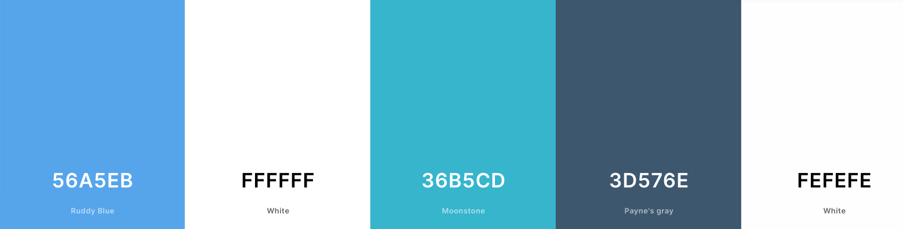
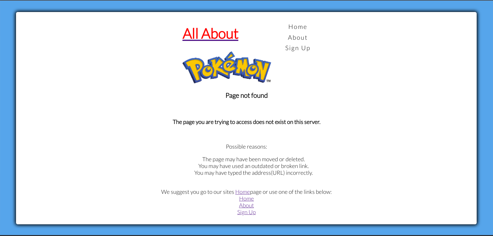

# **All About Pokémon**

All About Pokémon is a fun Pokémon-themed website that features fun  activities for kids and grown-ups alike. For now, the website only feature a simple quiz game. But the goal is, for future release, the website will have more activities, such as memory game, puzzles, spellings, word search and more. All pokémon-themed of course. I got this idea from my three young kids who all love and enjoy anything and everything about Pokémon.

View the live website here [All About Pokemon!](https://aylamccarthy.github.io/all-about-pokemon/).


## User Experience

### Initial Discussion
Quizzes have always been a popular choice of entertainment for kids and grown ups. This project was inspired by my three young children who are always up for a challenge, and love everything about Pokémon. And what better way to build a project than to combine these two and make an amazing Pokémon-themed website that will surely entertain both children and grown ups.


### External User's Goal:

* To be able to visit the website and play the game.
* To have fun while engaging ones brain.
* To be able to play the game on different devices.


### Site Owner's Goal:

* To be able to offer a fully responsive and interactive website that will entertain the user. 
* To be able to satisfy user's expectation so they will come back to the website as returning visitors.

### Possible Future Plans:
* To be able to upload new materials weekly, every Monday. To make sure to engage users and guarantee repeat visits.
* To offer more variety than just quizzes. For example, I would like to upload other games as well, such as puzzles, word search, spellings and memory games.
* To include a feature where users can save their progress.


## TABLE OF CONTENTS

* [Features](#Features)
    * [Site Wide](#site-wide)
    * [Landing Page](#landing-page)
    * [Sign Up PAge](#sign-up-page)
    * [Existing Features](#existing-features)
    * [Features Left to Implement](#possible-future-plans)


* [Design](#design)

    * [Wireframes](#wireframes)

* [Technologies](#technologies)
    * [HTML](#html)
    * [CSS](#css)
    * [JavaScript](#javascript)
    * [Github](#github)
    * [Git](#git)
    * [Tinyjpg](#tinypng)
    * [balsamiq](#balsamiq)

* [Testing](#testing)
    * [Responsiveness](#responsiveness)
    * [Accessibility](#accessibility)
        * [Wave](#wave-accessibility)
        * [Lighthouse](#lighthouse-testing)
    * [Functional Testing](#functional-testing)
    * [Validator Testing](#validator-testing)
        * [HTML](#html)
        * [CSS](#css)
        * [JavaScript](#javascript)
    * [Bugs/Unfixed Bugs](#bugs-unfixed-bugs)

* [Deployment](#deployment)
    * [Version Control](#version-control)
    * [Deployment to Github Pages](#deployment-to-github-pages)
    * [Clone the Repository Code Locally](#clone-the-repository-code-locally)

* [Resources, References and Credit](#resources-references-and-credit)
    


## Features
 The website has three pages.
 * Home page- the landing page where the quiz game is located.
 * About Page- where website users will find all the website information.
 * Sign Up page - where website users will be provided an option to sign up through a form.

### Site Wide
* Navigation Menu
* Contains links to the Home, About Us and sign Up pages and will be responsive on all devices.
This will allow users to easily navigate between the pages within the site on any device size.


### Landing Page

* The page has an appealing design and an intuitive navigation and orientation.
* The website is fully responsive on all screen sizes.
* Easy access to start the game.
* All these features aim to help to immediately show and entice the user what the website is about and how much fun they will have should they decide to proceed and play the game.


### Sign Up Page
 * A sign up form is provided to allow users to sign up to the website. The form will consist of the following fields and attributes:
    * Name (required, type=text)
    * Email (required, type=email)
    * Password (required, type=password)
    


* On successful submission of the Sign up form, the user will be navigated to thankyou.html displaying a success message.


### Existing Features

* Responsive design
* Interactive quiz game
* Sign up form and success page

### Color Scheme

The website used a pallete of pastel colors generated from https://coolors.co/generate. This is intentional choice to complement the bright and colorful world of Pokémon.



### Typography

Google Fonts was used for the following fonts:
* Lato
* Chivo Mono

### Accessibility

I have been mindful throughout the building process to ensure that the website is as accessible as possible. I tried to achieve this by:

 * Using semantic HTML.
 * Using  descriptive  alt attribute on images on the site.
 * Providing information for screen readers where there are icons and no text used, such as the footer icons.
 * Guaranteeing adequate colour contrast  throughout the site.


### 404 Page
The website has a custom 404 page with adequate information to guide users back to the site, should they happen to type the wrong URL or used broken links.




## Design

### Wireframes
The wireframes used were generated from Balsamiq https://balsamiq.com/wireframes/desktop/
The website design has a slight deviation from the initial design. The final design has a modal that shows the instruction on how to play the quiz.
<br><br>
Home page
<br><br>


About Us page.


Sign Up page


## Technologies

* HTML
    * The structure of the Website was developed using HTML as the main language.
* CSS
    * The Website was styled using custom CSS in an external file.
* JavaScript
    * JavaScript was used to ensure interactivity.
* GitHub
    * Source code is hosted on GitHub and delpoyed using Git Pages.
* Git
    * Used to commit and push code during the development of the Website
* Font Awesome
    * Icons obtained from https://fontawesome.com/ were used as the Social media links in the footer section.
* Tinyjpg
    * https://tinyjpg.com/ was used to reduce the size of the images used throughout the website
* balsamiq
    * Wireframes were created using balsamiq from https://balsamiq.com/wireframes/desktop/
* Coolors.co
    * The colour pallete used throughout the site was generated from Coolors.


## Testing

Testing was ongoing throughout the entire build. I utilised Chrome Developer tools while building to pinpoint and troubleshoot any issues as I went along.

See [TESTING.md](testing.md) for an overview of website testing and debugging.


# Deployment

## Version Control

The site was created using the Visual Studio code editor and pushed to github to the remote repository ‘All-About-Pokémon’.

The following git commands were used throughout development to push code to the remote repo:

```git add <file>``` - This command was used to add the file(s) to the staging area before they are committed.

```git commit -m “commit message” ``` - This command was used to commit changes to the local repository queue ready for the final step.

```git push``` - This command was used to push all committed code to the remote repository on github.


## Deployment to Github Pages

This project was created through [GitHub](https://github.com/):

1. Locating repository, clicking on the "New" button.
2. Selecting the relevant template: "Code-Institute-Org/gitpod-full-template"
3. Adding the repository name "all-about-pokemon".
4. Clicking the button "Create repository".

This project was developed using [GitPod](https://gitpod.io/) and committed and pushed to GitHub using the GitPod terminal. Following "git commands" were used:

1. **git add .** - This command for multiple files to the staging area before commiting.
2. **git commit -m "Message explaining update"** - This command explained changes that were done to the repository.
3. **git push** - This command was used to push all committed changes to the GitHub Repository.
4. **git status** - I tend to use this command often to make sure that all my changes are saved and my working tree is clean.

This project was deployed from its Github repository to Github Pages:

1. Log in to Github account
2. From the projects repository selecting "Settings" tab.
3. Click on "Pages" from the left-hand menu
4. The "Source" box must state "Deplay from branch"
5. Under "Branch", click the dropdown named "None" and select "main".
6. Click save.
7. After a few seconds, refresh the page and retrieve the link.


### Clone the Repository Code Locally

Navigate to the GitHub Repository you want to clone to use locally:

- Click on the code drop down button
- Click on HTTPS
- Copy the repository link to the clipboard
- Open your IDE of choice (git must be installed for the next steps)
- Type git clone copied-git-url into the IDE terminal

- The project will now have been cloned on your local machine for use.


## Resources, References and Credit

### Media and Fonts

- Google Fonts
- https://pixabay.com/
- https://pexels.com
- Pokemon Annual 2023
- Pokemon Super Deluxe Essential Handbook 
 
### Code

- https://developer.mozilla.org/en-US/docs/Web/API/Window/DOMContentLoaded_event
- https://www.w3schools.com/html/html_images.asp
- Kevin Powell "Modal Made Easy" Tutorial
- Kevin Powell "CSS Tutorials
- WebDev Simplified "Simple Quiz" Tutorial
- W3S Modals
- W3S JavaScript Tutorials
- Code Institute "Love Maths" Project
- My mentor Garreth McGirr for all the corrections,suggestions, guidance reassurance and patience.
- RealFaviconGenerator: Used to create a Favicon
- Gareth McGirr  "Tacos Travel" project.
- Kevin Powell Youtube Tutorial- HTML and CSS for Beginners. Responsive Design Made Easy.
- Code Institute-Slack Channel
- WebDev Simplified "Box-sizing" Tutorial

### Content

All the questions provided in the game were taken from Pokemon Annual 2023
and Pokemon Super Deluxe Essentials Handbook.
