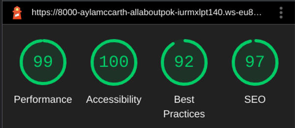
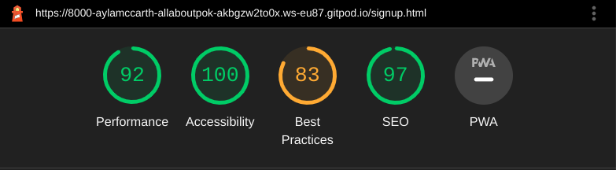

# Testing

## Contents

- [Functional Testing](#functional-testing)
- [Validator Testing](#validator-testing)
  - [HTML](#html)
  - [CSS](#css)
  - [JS](#js)
- [WAVE](#wave)
- [LightHouse](#lighthouse)
- [Browser Compatibility](#browser-compatibility)
- [Responsivity](#responsivity)
- [Issues/ Bugs Found & Resolved](#issues-bugs)
- [Unresolved](#unresolved)

## <a name="functional-testing">Functional Testing</a>

---

| Page       | Test                                                                                   | Completed successfully |
| :--------- | :------------------------------------------------------------------------------------- | :--------------------: |
| All        | Navigation links to relevant pages                                                     |          Yes           |
| All        | Navigation hover effect                                                                |          Yes           |
| All        | Navigation takes over 100% of the screen when toggled on mobile                        |          Yes           |
| All        | Social media icons in the footer link to the correct external link and open in new tab |          Yes           |
| Homepage   | Images and text flex responsively                                                      |          Yes           |
| Homepage   | New game starts when user clicks 'Start' button                                        |          Yes           |
| Game       | Images and text flex responsively                                                      |          Yes           |
| Game       | New game loads a random question                                                       |          Yes           |
| Game       | Scoreboard increments number of questions, score and progress bar                      |          not yet       |
| Game       | Green border is applied to correct answer and red border is applied to incorrect answer|          Yes           |
| Game       | Push current question out of question array                                            |          Yes           |
| Game       | Final Score is displayed                                                               |          not yet       |
| Game       | Appropiate text depending on score is displayed                                        |          not yet       |
| Sign Up    | User can only sign up when all required fields are filled in                           |          yes           |
| Game Score | Previous scores are displayed                                                          |          not yet       |

**Navigation Links**

Testing was performed to ensure all navigation links on the respective pages, navigated to the correct pages as per design. 
This was done by clicking on the navigation links on each page. Links on all pages navigated to the correct pages as expected.

| Navigation Link | Page to Load  |
|-----------------|---------------|
| Home            |  index.html   |
| About Us        |  aboutus.html |
| Sign Up         |  sign-up.html |

## <a name="validator-testing">Validator Testing</a>

---

### <a name="html">HTML</a>

[W3C Markup Validator](https://validator.w3.org/)

- No errors were returned when passing through the official W3S validator

Result

Home Page

About Us Page

Sign Up Page 

### <a name="css">CSS</a>

[W3C CSS Validator](https://jigsaw.w3.org/css-validator/)

This test returned no errors.
Results of the CSS test of style.css:

Result

- No errors were found when passing through the official (Jigsaw) validator
CSS Validator Results

### <a name="js">JS</a>

[JSHint JS Validator](https://jshint.com/)

All JavaScript files were validated through JSHint.

Result

## <a name="wave">WAVE</a>

---

[WAVE](https://wave.webaim.org/)

The WAVE WebAIM web accessibility evaluation tool was used to check for accessibility standards.

The first result gave a poor color contrast with the foreground text "Start" button with the white font. It was resolved by changing the font color to black.

Result

Testing was focused to ensure the following criteria were met:

- All forms have associated labels or aria-labels so that this is read out on a screen reader to users who tab to form inputs.
- Color contrasts meet a minimum ratio as specified in WCAG 2.1 Contrast Guidelines.
- Heading levels are not missed or skipped to ensure the importance of content is relayed correctly to the end user.
- All content is contained within landmarks to ensure ease of use for assistive technology, allowing the user to navigate by page regions.
- All not textual content had alternative text or titles so descriptions are read out to screen readers
- HTML page lang attribute has been set.
- Aria properties have been implemented correctly.
- WCAG 2.1 Coding best practices being followed.

## <a name="lighthouse">LightHouse</a>

---

Lighthouse was used (accessed through Developer Tools in Chrome) to analyse for the following:

- Performance
- Accessibility
- Best practice
- SEO

Homepage

About Us Page

Sign Up Page

## <a name="browser-compatibility">Browser Compatibility</a>

---

This website was tested on Chrome, Microsoft Edge, and Firefox for desktop.

The website was tested on Safari for mobile and tablet.

## <a name="responsivity">Responsivity</a>

---

### Responsiveness

All pages were tested to ensure responsiveness on screen sizes from 320px and upwards as defined in WCAG 2.1 Reflow criteria for responsive design on Chrome, Edge, Firefox and Opera browsers.

Responsiveness was tested through Chrome Developer tools. The devices tested include:

- iPhone SE
- iPhone XR
- iPhone 12 Pro
- Pixel 5
- Samsung Galaxy S8+
- Samsung Galaxy S20 Ultra
- iPad Air
- iPad Mini
- Surface Pro 7
- Surface Duo
- Galaxy Fold
- Samsung Galaxy A51

I was able to directly test the website on Samsung A10 and Samsung Galaxy S10.

Steps to test:

1. Open browser and navigate to 'All About Pokémon'
2. Open the developer tools (right click and inspect)
3. Set to responsive and decrease width to 320px
4. Set the zoom to 50%
5.  Click and drag the responsive window to maximum width.

Expected:

Website is responsive on all screen sizes and no images are pixelated or stretched. No horizontal scroll is present. No elements overlap.

Actual:

Website behaved as expected with the exception of switching to the viewport size to 320px. Details can be found in Unfixed Bugs.

**Form Testing**

The form on the sign up page was tested to ensure it functioned as expected when correct data was input and when incorrect data was input. The following test scenarios were covered:

_Scenario One - Correct Inputs_

Steps to test:

1. Navigate to [All About Pokémon](https://aylamccarthy.github.io/all-about-pokemon/) Sign Up Page.

2. Scroll down to the form and input the following data:
    - Name: John McCarthy
    - Email: mmcarthy@gmail.com
    - Password: *****
3. Click Submit
4. User should be redirected to signup.html confirmation page

Expected:

Form submits with no warnings or errors and user is redirected to signup.html confirmation page.

Actual:

Website behaved as expected with no errors or warnings and redirected to thankyou.html.

_Scenario Two - Missing Required Field  Name_

Steps to test:

1. Navigate to   [All About Pokémon](https://aylamccarthy.github.io/all-about-pokemon/) Sign Up Page.
2. Scroll down to the form and input the following data:
    - Name: 
    - Email: mmcarthy@gmail.com
    - Password: ******
3. Click Submit

Expected:

The form does not submit and an Error is displayed to tell the user that the field is required.

Actual:

Website behaved as expected, error message was displayed and the form did not submit.

_Scenario Three - Missing Required Field Password_

Steps to test:

1. Navigate to  [All About Pokémon](https://aylamccarthy.github.io/all-about-pokemon/) Sign Up Page.
2. Scroll down to the form and input the following data:
- Name: 
    - Name: John McCarthy
    - Email: mmcarthy@gmail.com
    - Password:
    

3. Click Submit

Expected:

The form does not submit and an Error is displayed to tell the user that the field is required.

Actual:

Website behaved as expected, error message was displayed and the form did not submit.

## <a name="issues-bugs">Issues/ Bugs Found & Resolved</a>

---

### Validation Issues

The initial W3S Mark Up Validation returned some errors. But I was able to resolve all of them on time.
The initial test returned an error for JsHint.

### Wave Issue

The first result gave a poor contrast  for the white font of "Start" button. I resolved it by changing the font color to black.

## <a name="unresolved">Unresolved</a>

## Bugs/Unfixed Bugs

I encountered so many bugs through out the whole process of building this website. Most of them I resolved on time. But the ones listed below were the ones I found most challenging;

 Responsiveness: 

- Expected: The website would work on all devices, screen sizes and orientation.
- Actual: Responsiveness of the website did not work as expected on mobile devices. 
- Solution: With more research and mentor consultation, and changing my codes as necessary, I was able to fix these bugs on time, with the exception of the Footer which is still not working as expected on mobile devices. But will do my very best to have this fixed on future release.

### The Footer would not stick to the bottom of the page

During testing I found out that the footer would not stick to the
 bottom of the page. This bug is still unresolved.

 